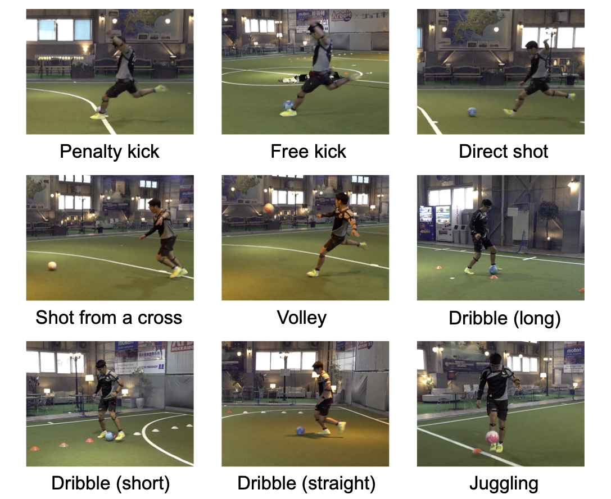
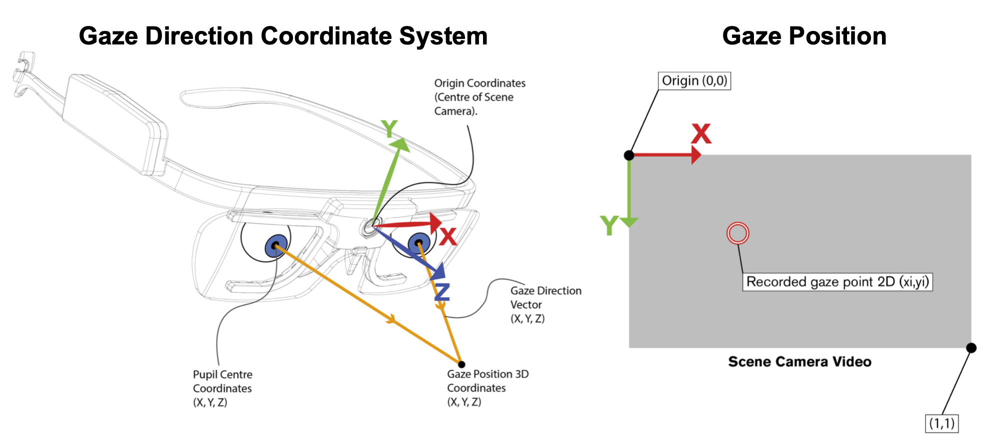
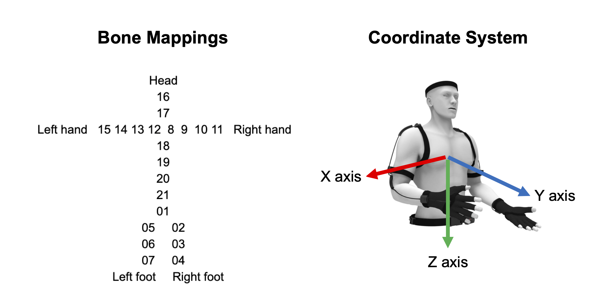

# Expert-Novice Soccer Dataset

The dataset for the following paper:
Y. Akamatsu, K. Maeda, T. Ogawa, and M. Haseyama, “Classification of Expert-novice Level Using Eye Tracking and Motion Data via Conditional Multimodal Variational Autoencoder,” IEEE International Conference on Acoustics, Speech and Signal Processing (ICASSP), 2021 (accepted for publication).

## Nine Actions in Our Experiment

## Players

The total number of samples is 288 (= eight players * nine actions * four times).
- Player1-4 : Novice players
- Player5-8 : Expert players (more than 10 years of soccer experience)

|       | # Expert level samples | # Novice level samples | # All samples  |
| :----: |:------:| :------:| :-----: |
|Player1| 1 | 35 | 36 |
|Player2| 1 | 35 | 36 |
|Player3| 24 | 12 | 36 |
|Player4| 0 | 36 | 36 |
|Player5| 36 | 0 | 36 |
|Player6| 36 | 0 | 36 |
|Player7| 35 | 1 | 36 |
|Player8| 36 | 0 | 36 |
|All players| 169 | 119 | 288 |

## Eye Tracking Data
- EyeTrackingData/Player`<player index>`/S`<sample index>`/`<feature>`_vec.csv
  -  `<player index>` : 1-8
  -  `<sample index>` : 01-04 (Penalty kick), 05-08 (Free kick), 09-12 (Direct shot), 13-16 (Shot from a cross), 17-20 (Volley), 21-24 (Dribble (long)), 25-28 (Dribble (short)), 29-32 (Dribble (straight)), 33-36 (Juggling)
  -  `<feature>`_vec.csv : Feature values corresponding to timestamp. A CSV file includes a vector (timestamp * 1). Note that the first element of the vector is the dimension of vector (i.e., the number of timestamps).
  -  `<feature>` : Features included in eye tracking data (see the following table).

| `<feature>`| Name | Description | 
| :---- |:------| :------| 
|ac0, ac1, ac2 (X, Y, Z axis)| Accelerometer Data | The accelerometer data indicates the rotation of the glasses. The accelerometer data has the unit meter per second squared [m/s^2]. |
|gd00, gd01, gd02 (X, Y, Z axis)| Gaze Direction (Left eye) | The gaze direction is a unit vector with origin in the pupil center. |
|gd10, gd11, gd12 (X, Y, Z axis)| Gaze Direction (Right eye) | Same as above |
|gp0, gp1 (X, Y axis)| Gaze Position | The gaze position is the position on the scene camera image where the gaze will be projected. Top left corner is (0,0), bottom right corner is (1,1).|  
|gp30, gp31, gp32 (X, Y, Z axis)| Gaze Position 3d | GazePosition3d is the 3D position, in mm, relative to the scene camera where the gaze is focused.| 
|gy0, gy1, gy2 (X, Y, Z axis)| Gyroscope Data | The gyroscope data indicates the rotation of the glasses. The gyroscope data has the unit degrees per second [°/s].|
|pc00, pc01, pc02 (X, Y, Z axis)| Pupil Center (Left eye) | The property pupil center is specified in 3D coordinates with origin in the scenecam.  The value is sent separately for each eye and the coordinates are in mm.|
|pc10, pc11, pc12 (X, Y, Z axis)| Pupil Center (Right eye) | Same as above |
|pd0, pd1 (Left eye, Right eye)| Pupil Diameter | The pupil diameter is measured in mm and sent separately for each eye. |

## Motion Data
- MotionData/Player`<player index>`/S`<sample index>`.txt 
  - `<player index>` : 1-8
  - `<sample index>` : 01-04 (Penalty kick), 05-08 (Free kick), 09-12 (Direct shot), 13-16 (Shot from a cross), 17-20 (Volley), 21-24 (Dribble (long)), 25-28 (Dribble (short)), 29-32 (Dribble (straight)), 33-36 (Juggling)
  - S`<sample index>`.txt : Feature values corresponding to timestamp. A text file includes a matrix (timestamp * kinds of features).
- MotionData/feature_info.csv : Feature names included in motion data. The feature name is represented as `<bone mappings>`-`<feature>`-`<axis>` (see the following figures and table). The feature name corresponds to the column in S`<sample index>`.txt.

| `<feature>`| Description | 
| :---- |:------| 
| X | World coordinate displacement. Unit is meter.| 
| V | World coordinate displacement. Unit is meter per second. | 
| Q | World coordinate module's posture data. | 
| A | Module coordinate accelerated speed. Unit is g. | 
| W | Module coordinate accelerated speed. Unit is radian per second. | 

## Expert-Novice Level
- Expert-Novice-Scores : Scores of the expert-novice level (matrix : `<sample index>` * `<player index>`, min : 1, max : 4). Each sample was given with scores (four-grade) by 57 persons (more than five years of soccer experience), and then the scores were averaged. In our experiment, samples with more than 2.5 score were labeled as the expert level and samples with less than 2.5 score were labeled as the novice level. 

